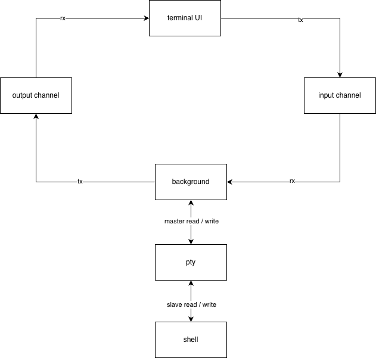
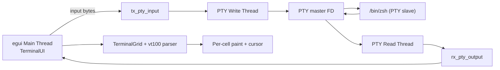
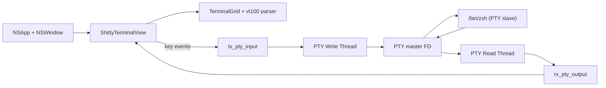

# Shitty

        _            _       _     _        _          _    _        _   
       / /\         / /\    / /\  /\ \     /\ \       /\ \ /\ \     /\_\ 
      / /  \       / / /   / / /  \ \ \    \_\ \      \_\ \\ \ \   / / / 
     / / /\ \__   / /_/   / / /   /\ \_\   /\__ \     /\__ \\ \ \_/ / /  
    / / /\ \___\ / /\ \__/ / /   / /\/_/  / /_ \ \   / /_ \ \\ \___/ /   
    \ \ \ \/___// /\ \___\/ /   / / /    / / /\ \ \ / / /\ \ \\ \ \_/    
     \ \ \     / / /\/___/ /   / / /    / / /  \/_// / /  \/_/ \ \ \     
 _    \ \ \   / / /   / / /   / / /    / / /      / / /         \ \ \    
/_/\__/ / /  / / /   / / /___/ / /__  / / /      / / /           \ \ \   
\ \/___/ /  / / /   / / //\__\/_/___\/_/ /      /_/ /             \ \_\  
 \_____\/   \/_/    \/_/ \/_________/\_\/       \_\/               \/_/  
                                                                         


A tiny terminal emulator in Rust. Uses vt100 for parsing, a PTY for the shell,
and two UI paths: egui everywhere, and a native AppKit renderer on macOS.

## Quick Start

```bash
cargo run
```

Other useful commands:

```bash
cargo build
cargo build --release
cargo clippy
cargo fmt
```

Binary output: `target_local/` (see `.cargo/config.toml`).

## Features

- VT100 parsing via `vt100` with a cell grid model.
- PTY-backed shell (`/bin/zsh`) with proper resize signaling.
- ANSI 16-color, xterm 256-color, and truecolor RGB support.
- Wide-character handling and underline rendering.
- Cursor rendering with inverse and custom cursor color support.
- Two UI paths:
  - macOS AppKit renderer with native key handling.
  - egui renderer for non-macOS platforms.
- Nerd Font monospace rendering (bundled fonts in `assets/`).

## Architecture



### Core Data Flow (egui path)



### Core Data Flow (macOS AppKit path)



## Project Layout

- `src/main.rs`: OS routing (macOS AppKit vs egui).
- `src/app.rs`: egui bootstrapping, PTY threads, and font setup.
- `src/mac_app.rs`: native AppKit window, view, and renderer.
- `src/ui.rs`: egui renderer and input loop.
- `src/pty.rs`: resize handling and signals (non-macOS).
- `src/terminal/grid.rs`: vt100 parser wrapper and grid access.
- `src/terminal/color.rs`: ANSI/xterm color mapping.
- `src/keymap.rs`: key event translation (egui + macOS).

## Notes

- The egui path drives repaints on PTY output to avoid busy loops.
- The AppKit path uses an NSTimer to drive render updates at ~60Hz.
- Resizes propagate through TIOCSWINSZ and SIGWINCH to keep shells happy.

## Build Requirements

- Rust 2024 edition (see `Cargo.toml`).
- macOS build uses objc2 + AppKit frameworks (no extra setup required).
